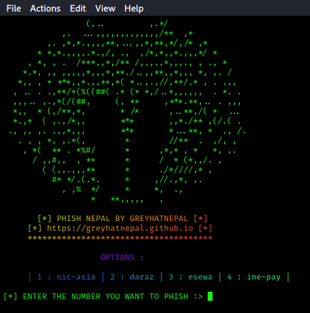

<!-- PHISHNEPAL ! - SUPER EASY NEPALI-PAYMENT ACCOUNTS PHISHER ! -->

<html>

<title>Anonymous Nepal</title>

<head>
<meta name="viewport" content="width=device-width, initial-scale=1.0">
<link rel="stylesheet" type="text/css" href="//fonts.googleapis.com/css?family=Iceland" />
<link rel="stylesheet" href="https://stackpath.bootstrapcdn.com/font-awesome/4.7.0/css/font-awesome.min.css" crossorigin="anonymous">  

</head>

<body>

Anonymous Nepal

&copy; YourAnonNewsNp | <a href="mailto:greyhatnepal@protonmail.com">E-MAIL</a>   

 
</body>
</html>

***

## INSTALLATION

| anonymous@anonymous:-$ git clone https://github.com/greyhatnepal/phishnepal   |
| anonymous@anonymous:-$ cd phishnepal                                          |
| anonymous@anonymous:-$ sudo cmhod +x *                                        |
| anonymous@anonymous:-$ ./phishnepal                                           |

***

### Usage Demo:

